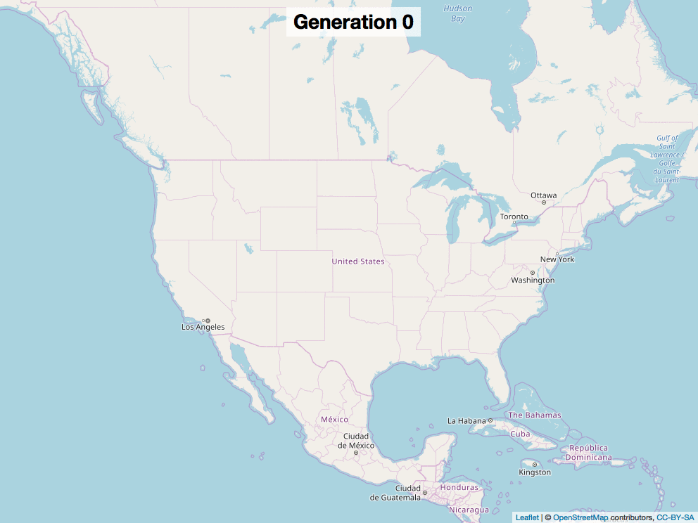

```{r setup, include=FALSE}
knitr::opts_chunk$set(echo = TRUE)
library(tidyverse)
library(igraph)
library(ggraph)
library(magrittr)
library(leaflet)
library(lubridate)

# gd <- read_csv("../../static/data/my_fam.csv")

gd <- read_csv(here::here("static", "data", "my_fam.csv"))

cities <- read_delim("../../static/data/city_coords.csv", delim = ";") %>% 
  separate(Coordinates, into = c("lat", "long"), sep = ",") %>%
  mutate(lat = as.numeric(lat),
         long = as.numeric(long))

### Making other variables / cleanup

# Some clean up
gd$lastname <- gsub("/", "", gd$lastname)
gd$FAMS <- gsub("NA ", "", gd$FAMS)

gd %<>%
  filter(!is.na(id)) %>%
  mutate(birthlat = as.numeric(birthlat),
         birthlong = as.numeric(birthlong),
         deathlat = as.numeric(deathlat),
         deathlong = as.numeric(deathlong),
         birthdate = dmy(birthdate),
         deathdate = dmy(deathdate),
         age = year(deathdate) - year(birthdate))

gd$FAMS[1] <- 0

gd %<>%
  mutate(generation = if_else(as.numeric(str_extract(FAMS,"[:digit:]+")) == 0, 0, if_else(as.numeric(str_extract(FAMS,"[:digit:]+")) == 1, 1, 
                              if_else(as.numeric(str_extract(FAMS,"[:digit:]+")) < 4, 2, if_else(as.numeric(str_extract(FAMS,"[:digit:]+")) < 8, 3, if_else(as.numeric(str_extract(FAMS,"[:digit:]+")) < 16, 4, if_else(as.numeric(str_extract(FAMS,"[:digit:]+")) < 32, 5, if_else(as.numeric(str_extract(FAMS,"[:digit:]+")) < 64, 6, if_else(as.numeric(str_extract(FAMS,"[:digit:]+")) < 128, 7, if_else(as.numeric(str_extract(FAMS,"[:digit:]+")) < 256, 8, if_else(as.numeric(str_extract(FAMS,"[:digit:]+")) < 512, 9, 10)))))))))),
         gencol = if_else(generation == 0, "black",
                         if_else(generation == 1, "green",
                                 if_else(generation == 2, "blue",
                                         if_else(generation == 3, "red",
                                                 if_else(generation == 4, "pink",
                                                         if_else(generation == 5, "purple", "grey")))))),
         anc_title = case_when(generation == 0 ~ "Me",
                               generation == 1 ~ "Parent",
                               generation == 2 ~ "Grandparent",
                               generation == 3 ~ "1st G GP",
                               generation == 4 ~ "2nd G GP",
                               generation == 5 ~ "3rd G GP",
                               generation == 6 ~ "4th G GP",
                               generation == 7 ~ "5th G GP",
                               generation == 8 ~ "6th G GP",
                               generation == 9 ~ "7th G GP",
                               generation == 10 ~ "8th G GP",),
         birthlat = case_when(generation == 0 ~ birthlat - 3 + runif(1, -.1, .1),
                               generation == 1 ~ birthlat - 3 + runif(1, -.1, .1),
                               generation == 2 ~ birthlat - 3 + runif(1, -.1, .1),
                               generation == 3 ~ birthlat - 3 + runif(1, -.1, .1),
                               generation == 4 ~ birthlat - 3 + runif(1, -.1, .1),
                               generation == 5 ~ birthlat - 3 + runif(1, -.1, .1),
                               generation == 6 ~ birthlat - 3 + runif(1, -.1, .1),
                               generation == 7 ~ birthlat - 3 + runif(1, -.1, .1),
                               generation == 8 ~ birthlat - 3 + runif(1, -.1, .1),
                               generation == 9 ~ birthlat - 3 + runif(1, -.1, .1),
                               generation == 10 ~ birthlat - 3 + runif(1, -.1, .1),),
         birthlong = case_when(generation == 0 ~ birthlong - 3 + runif(1, -.1, .1),
                               generation == 1 ~ birthlong - 3 + runif(1, -.1, .1),
                               generation == 2 ~ birthlong - 3 + runif(1, -.1, .1),
                               generation == 3 ~ birthlong - 3 + runif(1, -.1, .1),
                               generation == 4 ~ birthlong - 3 + runif(1, -.1, .1),
                               generation == 5 ~ birthlong - 3 + runif(1, -.1, .1),
                               generation == 6 ~ birthlong - 3 + runif(1, -.1, .1),
                               generation == 7 ~ birthlong - 3 + runif(1, -.1, .1),
                               generation == 8 ~ birthlong - 3 + runif(1, -.1, .1),
                               generation == 9 ~ birthlong - 3 + runif(1, -.1, .1),
                               generation == 10 ~ birthlong - 3 + runif(1, -.1, .1),)
         )

for (i in 1:length(gd$id)) {
  int <- sample(1:length(cities$City), 1, replace = T)
  gd$birthplace[i] <- paste0(cities$City[int], ", ", cities$State[int])
  gd$birthlat[i] <- cities$lat[int]
  gd$birthlong[i] <- cities$long[int]
}

```

### Introduction

During the 4th of July I started to have this question: which of my ancestors served in the Revolutionary War? I began my search for records of proof of service on FamilySearch and Ancestry. As I was clicking up and down my family tree, I wondered if there was a way to read the family history (GEDCOM) files in R. After an in-depth search, I couldn’t find anyone with a good GEDCOM parser that would turn it into CSV format in R (however, a similar project was recently begun; https://www.r-bloggers.com/gedcom-reader-for-the-r-language-analysing-family-history/). So, I decided that I would take a crack at it and start exploring my family’s data. 

I decided to go with the family tree off of my FamilySearch account mainly because a lot of the searching has been done for you, and their files come with latitudes and longitudes. One thing to keep in mind, the farther back you go in your tree, the information may not be correct. Luckily, someone already built a way to get your GEDCOM file from FamilySearch. It does require python3. You can go to their site to learn more:

https://github.com/Linekio/getmyancestors

You can also get a GEDCOM file off of Ancestry by following these instructions:

https://support.ancestry.com/s/article/Uploading-and-Downloading-Trees

Feel free to use my read_gedcom function from here:

```{r eval=FALSE}
# install.packages("devtools")
devtools::install_github("jjfitz/readgedcom")
```


It is still in the developmental stages, but in its current format, it is able to grab useful information such as names, birth/death dates, birth/death places, what family they come from, and what children they had. It does not gather everything that a GEDCOM file stores, but I will be working on it gathering more information shortly.

As mentioned earlier, I will demonstrate this idea using my own line, albeit with changes to locations and other identifiable information. The following graphic is a density plot showing the ages of my direct ancestors.

```{r}
# Density
gd %>%
  filter(age < 120 & age > 0) %>%
  ggplot(aes(age, color = sex)) +
  geom_density()
```


In this dataset, I went back 10 generations. It was able to provide `r gd %>% filter(sex == "M") %>% group_by(sex) %>% summarize(count = n()) %>% pull(count)` males and `r gd %>% filter(sex == "F") %>% group_by(sex) %>% summarize(count = n()) %>% pull(count)` females.

Next, I built out a pedigree chart.

```{r}
gd$FAMS[1] <- gd$FAMC[1]
fam_graph <- gd %>%
  mutate(FAMS = if_else(FAMS == "", FAMC, FAMS)) %>%
  filter(FAMC != "", generation < 5) %>%
  select(FAMS, FAMC, anc_title) %>%
  graph_from_data_frame()

g_name <- gd %>%
  mutate(FAMS = if_else(FAMS == "", FAMC, FAMS)) %>%
  filter(FAMC != "", generation < 5) %>%
  select(FAMS, FAMC, anc_title)

g_name$V_verts <- V(fam_graph)$name

correct_name <- g_name %>%
  left_join(gd, by = c("V_verts" = "FAMC"))

fam_graph <- correct_name %>%
  mutate(FAMS.x = if_else(FAMS.x == "", FAMC, FAMS.x)) %>%
  filter(FAMC != "", generation < 5) %>%
  select(FAMS.x, FAMC, anc_title.y) %>%
  graph_from_data_frame()

V(fam_graph)$F_name <- E(fam_graph)$anc_title.y

ggraph(fam_graph, layout = "dendrogram") +
  geom_edge_link() +
  geom_node_point() +
  geom_node_text(aes(label = F_name), vjust = 1, hjust = 1, angle = 35) +
  expand_limits(x = -.5, y = -.5)
```


I was also curious about my ancestors’ migratory path, so here is a map displaying that path, with me as generation 0. 

```{r}

gd %<>%
  filter(generation < 7)

leaflet() %>%
  addTiles() %>%
  addCircles(lng = gd$birthlong, 
             lat = gd$birthlat,
             popup = paste0("Id: ", gd$id, "<br />",
                            "Birth Place: ", gd$birthplace, "<br />"
                            ),
             color = gd$gencol) %>%
  addLegend(colors = levels(as_factor(gd$gencol)), labels = levels(as_factor(gd$generation)))

```

While the general migratory path was interesting, I wanted to focus on the descendants of someone specific, so I found the first member of my family to be born in America on my paternal side, and mapped out his descendants. The following .gif portrays the migratory path of that ancestor (who, incidentally, did fight in the Revolutionary War!) and his descendants.




There are other questions that would be fun to explore, such as: Is there any intermingling between other trees in my line? Who had the most living descendants before they died? What is the average distance between where they were born and where they died?

I hope that this parser can aid others in learning more about their family history, as well as make it easier for those who are just beginning to find the gaps in their heritage. 

<br />
<br />
<br />
<br />
<br />


